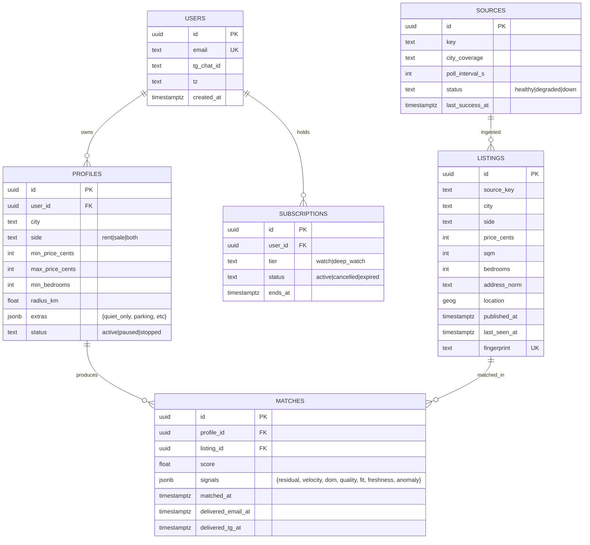

# 12 · Technical specification

> Skyline Watch = ingest layer (60–300s pollers) + scoring engine (7-signal) + delivery (email +
> Telegram + iOS push). Wave 2 ships landing + checkout. Wave 3 ships ingest + scoring + delivery.

## 1. Architecture overview

```mermaid
flowchart LR
  subgraph Edge[storage-contabo · Traefik]
    Tr[Traefik]
  end
  subgraph Landing[apps/landing · Next.js 15]
    L[Marketing + tier picker]
    CK[/api/checkout/nowpayments]
    WH[/api/webhooks/nowpayments]
  end
  subgraph App[apps/app · Wave 3 Wasp]
    PROFILE[Profile setup]
    DASH[Match dashboard]
    OPCONS[Operator console]
  end
  subgraph Ingest[apps/api · Bun + Hono]
    P[Source pollers · 60-300s]
    N[Normalizer]
    D[Deduper]
    L_STORE[Listing store]
  end
  subgraph Scoring[7-signal model]
    C[Comp residual]
    V[Cut velocity]
    M[DOM context]
    Q[Listing quality]
    F[Profile fit]
    H[Freshness]
    A[Anomaly]
  end
  subgraph Delivery
    QM[Match queue]
    EM[Email worker]
    TG[Telegram bot · @SkylineWatchBot]
    IOS[iOS push · Wave 4]
  end
  subgraph Sources
    MLS[MLS / IDX]
    Z[Zillow]
    R[Realtor / Redfin]
    EU[ImmoScout · Idealista · Funda · Rightmove · Zoopla · ...]
  end
  subgraph Data
    PG[(Postgres)]
    R_CACHE[(Redis · dedupe + score cache)]
    S3[(B2 · listing snapshots)]
  end
  subgraph Ext
    NP[NOWPayments]
    PM[Postmark]
  end
  Tr --> L
  Sources --> P --> N --> D --> L_STORE
  L_STORE --> Scoring
  Scoring --> QM
  QM --> EM
  QM --> TG
  EM --> PM
  PROFILE --> PG
  L_STORE --> PG
```

## 2. Data model



Indexes: `listings.fingerprint` UNIQUE, `listings.city + listings.published_at`, GIST on
`listings.location`, `(matches.profile_id, matches.listing_id)` UNIQUE.

## 3. API contracts

### Public

| Method | Path | Auth | Request | Response |
|---|---|---|---|---|
| POST | `/api/checkout/nowpayments` | none | `{tier}` | `{invoice_url}` |
| POST | `/api/webhooks/nowpayments` | HMAC-SHA512 | NOWPayments IPN | `{ok:true}` |

### Internal

| Method | Path | Auth | Body |
|---|---|---|---|
| POST | `/api/v1/profiles` | session | `{...profile}` |
| GET | `/api/v1/matches` | session | `?since=` |
| POST | `/api/v1/profiles/:id/pause` | session | `{}` |
| GET | `/api/v1/sources` | session(operator) | — |
| POST | `/api/v1/sources/:id/restart` | session(operator) | `{}` |

### Telegram bot

`/start` pairs the chat to a user via 6-digit code; `/pause` pauses all profiles; `/resume`.

## 4. Integrations

| 3rd-party | Auth | Rate | Fallback |
|---|---|---|---|
| MLS/IDX feeds | per-MLS auth | varies | Mark source degraded |
| Public sources (Zillow / Idealista / etc.) | none + UA | per-source | Polite headers; back-off on 429 |
| Geocoder (Nominatim self-host or Mapbox) | API key (Mapbox) | tier | Self-host fallback |
| Postmark | server token | 10k/day | Resend |
| Telegram Bot API | bot token | 30/sec | Email-only fallback |
| NOWPayments | x-api-key + IPN HMAC | 100 RPM | Manual invoice |

## 5. Storage

- Postgres 16 + PostGIS for `LISTINGS.location` geometry.
- Redis: dedup fingerprints (hot 24h), scoring cache, match queue.
- B2: per-listing photo + metadata snapshot (for fairness during disputes).
- Retention: listings 24 months; matches forever (audit); user PII deleted on cancel + 90 days.

## 6. Auth

- Wave 2 anonymous checkout.
- Wave 3 magic-link.
- Telegram pairing 6-digit code.

## 7. Security

- Secrets in `.env`.
- Rate limits: profile create 10/IP/hr; matches GET 60/min/user.
- IPN HMAC; idempotent.
- PII: emails + tg ids; redacted in logs.
- Politeness: poller respects each source's robots.txt + per-source caps.

## 8. Observability

- Pino JSON logs → Loki.
- Metrics: `skyline.source.freshness_s`, `skyline.match.delivery_ms`, `skyline.dedup.rate`,
  `skyline.score.distribution`.
- Alerts: source freshness > SLA; delivery > 60s p95; dedup rate spike.

## 9. Performance budgets

| Path | p50 | p95 |
|---|---|---|
| Ingest → notify | 35s | 60s |
| Profile create | 200ms | 500ms |
| Match dashboard load | 600ms | 1.5s |
| CSV export (30 days) | 800ms | 3s |

Throughput: 50 sources × 50k listings/day total.

## 10. Non-goals

- No "AI buy/no-buy advice."
- No private-broker scraping (TOS-respect mode).
- No North-Korea / sanctioned-region listings.
- No daily-only tier.
- No native mobile app Wave 2/3 (iOS push deferred).
- No global one-toggle search.
- No agent-side / listing-side product (we serve buyers, not brokers).
